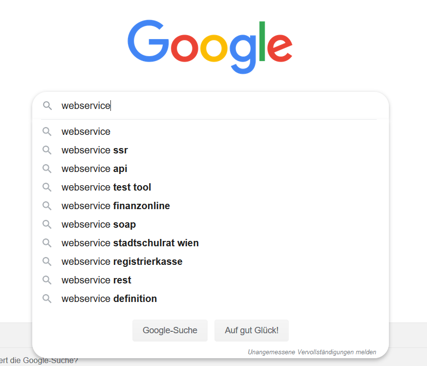

# Web Service Development #

**EDUCATION Repository**

## First introduction to simple Web Services

We will start with **three Web Services** and three simple demonstration Scripts written in Python. We recommend to extend those scripts with User Inputs, some Interaction and also to integrate the concept of Web **Requests and Responses** to other programming languages like Java, C#, ...

### Google Autocomplete

Google provides a Webservice to autocomplete the Google Search. It's one of a few Web Services without Authentication Process, because of e.g. Google Toolbar, Firefox and other systems which are using this Autocompletion (?)

**URL**

- XML Version [https://www.google.com/complete/search?hl=de&output=toolbar&q=webservice](https://www.google.com/complete/search?hl=de&output=toolbar&q=webservice)  
- JSON Version [https://www.google.com/complete/search?hl=de&output=firefox&q=webservice](https://www.google.com/complete/search?hl=de&output=firefox&q=webservice )  (it includes a JSON Object)

**Parameters**

- `hl=<your language>`
- `output=<response type>` (in this case it referes to the client)
- `&q=<search term>`

**Use Case**

Google uses this Web Service for asynchron loading the auto complete suggestions

**Script**

- [google-autocomplete.py](google-autocomplete.py "Python Script")

**Next steps**

- Get in touch with python requests
- Use python requests also for other Webservices
- Try to transfer this simple Webservice call to other programming languages like Java, C#, ...

### OpenCage Geocoding API 
In the mobile world we need sometimes to convert geo locations with longitude and latitude to places with **Reverse geocoding**, and the other way round to receive longitude and latitude by placename with **Forward geocoding**.

**Documentation**

Just go to [Quick Start](https://opencagedata.com/api) of OpenCage and take a look on the first examples of both types of geocoding. You will also find your personal API Key with a Rate Limit (currently about 2500 Request per Day). More information at your OpenCage [Dashboard](https://opencagedata.com/dashboard).

**Use Case**
Geocoding is needed e.g. for mobile navigation. You will type in any place on your smartphone app. The App will send the request to e.g. OpenCage API and you will receive the needed Geo Information for visualization on e.g. a map.

Also the other way round is a common usecase. Maybe you will send current place to any friend, it's easier with readable information like "Hi I'm in Kapfenberg!" instead of "Hi I'm at lat 47.44055 lon 15.29017". 

**Nice to know**: OpenCage also includes a link to [OpenStreetMap](https://www.openstreetmap.org/?mlat=47.44055&mlon=15.29017#map=13/47.4377/15.2809&layers=H).

**Script**

- [geocoding.py](geocoding.py "Python Script")

**Next steps**

- Get in touch with OpenCage Geocoding
- Try to transfer this Example to other programming languages like Java, C#, ...

**Nice to know**: OpenCage includes a lot of code examples for different [programming languages](https://opencagedata.com/code)

### OpenWeatherMap Weather API 
In some cases it's nice to know the current weather or a weather forecast. To identify current weather smartphone apps are nice, but not really needed for the current location, but to take a look of the current weather situation about 100km away we need a weather service. Also to forecast the weather in a few days we have not the knowledge about meteorology, so a weather service is needed to get e.g. a forecast for the next 3 days.

**Documentation**

Just go to [Current weather data](https://openweathermap.org/current) of OpenWeatherMap and take a look on different current and later forecast data. You will also find your personal API Key with a Rate Limit (currently about 60 Request per Hour). More information at your [API Keys](https://home.openweathermap.org/api_keys).

**Use Case**
It's Thursday and you are not sure about the roadtrip at the weekend. You will start your weather app on your smartphone and will look for your road trip destination. Current weather looks bad, but the forecast for the next days predict a sunny weekend.

**Script**

- [weather.py](weather.py "Python Script")

**Next steps**

- Get in touch with OpenWeatherMap API
- Try to get a [hourly forecast](https://openweathermap.org/api/hourly-forecast)
- Try to get a [16 days forecast](https://openweathermap.org/forecast16)
- Create script which create a pretty output of current and 16 days weather

### Additional and recommended References

**How to use python requests modul?**

    pip3 install requests

- https://requests.readthedocs.io/en/latest/
- https://realpython.com/python-requests/
