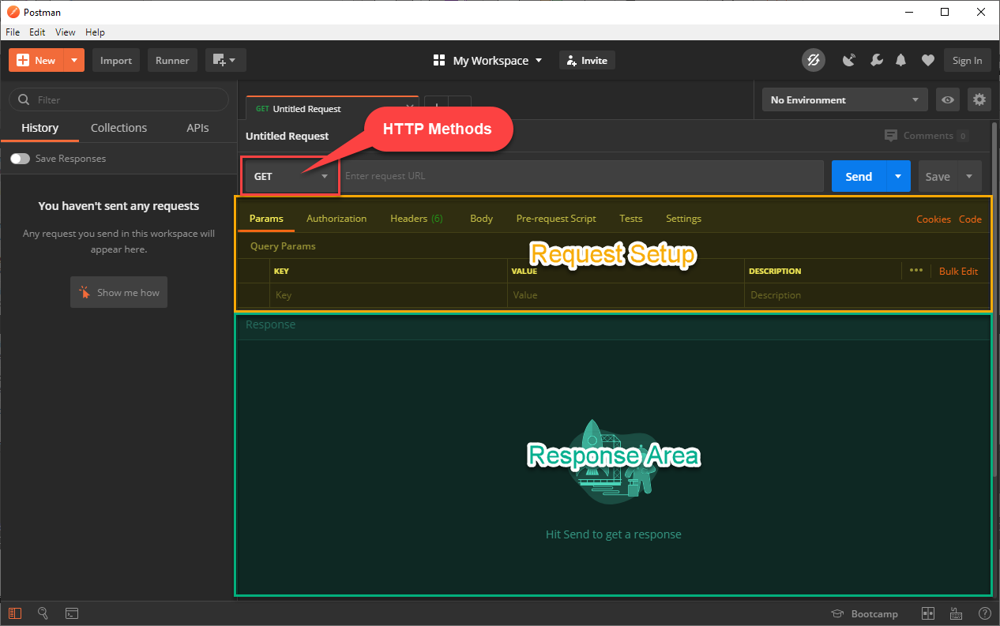

# ReST testing with Postman

In this exercise, we will test our REST-Service tool-based.  
We will use [Postman](https://www.postman.com/) to execute the tests. To run them, you have to start the [node ReST service](../rest).

```console
$ cd ../rest
$ npm start
```

## Prerequisites
In this exercise, we will use [Postman](https://www.postman.com/) to test our ReST API. So at first, please install (the latest version of) [Postman](https://www.postman.com/downloads/) on your system. Please do **not** use the Browser Plugin, because it is **deprecated**!

On the first start, you will be asked to register/login. You can skip this with *Skip signing in and take me straight to the app* on the bottom


> The registration is free and offers you some advantages, e.g. share your history and settings through multiple installation. it would be also necessary if you want to work collaborative with postman. but for this exercise/tutorial, it wouldn't be needed.

To run the service, you also need [NodeJS](https://nodejs.org/en/) (I will recommend the LTS Version!) and [`npm`](https://www.npmjs.com/) or [`yarn`](https://classic.yarnpkg.com/en/).

## Postman application
Postman comes with many features. For this first introduction, we will focus on the Request pane an in there on some sub areas.


Like in a browser, you can open multiple Request tabs. On the top, you can select the wanted **HTTP Method** and enter the URL, which you will request. All send requests would be saved inside the **History** on the left side.

On the right upper corner, you're able to set different environments, where you can define multiple variables, which can than be used within the request.


If you want, you can setup some environment variables and use them like in the pictures above for your requests. Be sure, that you selected the correct *Environment* in the environment list, otherwise this variables will be not available or set with wrong values, which can cause unexpected behavior.

## First Requests
Before we start with (automatically evaluated) tests, familiarize yourself with postman first.

> Start the [node ReST service](../rest), so that you can perform queries via postman.

Use the known implemented endpoints and make some requests with the different HTTP-methods.

### GET
The simplest one will be a GET-Request. Like if you're surfing with your browser, add the URI to the `/notes` resources and **Send** the request. If everything works fine, you will get a response with the 3 pre-defined notes.
.

Try also to get a specific **note**. What happens, when you try to get a note that doesn't exists?

- [x] GET all
- [ ] GET specific (existing) ID
- [ ] GET nonexisting ID

### POST
For a POST, you have first to switch the HTTP-Method left to the URL.  
When we send a POST-Request, we typically need to send a Request-Body to our service. To add that, switch on the Request-Area to the *Body* tab and enter **raw** data. On the dropdown on the right, you can switch to a specific data type (e.g. JSON), which will bring you some syntax highlighting, additionally the appropriate content-type header is added to the request.


- [x] POST new data

### PUT and DELETE
Now it's your turn. Try also a PUT and a DELETE request. How does they look like when you send them on a valid recourse and how on invalid?

- [ ] PUT existing data
- [ ] PUT nonexisting data
- [ ] DELETE existing data
- [ ] DELETE nonexisting data

> If you need to reset the data-source, simple restart the node server.


## Automated testing with Postman
Postman brings its own testing environment. You may already detected the **Tests** tab in the request area and the **Test Results** tab in the response.

Postman run its own JavaScript enginge which brings the ability to script the program. The scripting in Postman is comprehensive, we will only scratch the surface here.


Beside the **Tests** tab in the request area, where we will define our test cases, we will also need the **Per-request Script**, where we can do some setup.

.

To save our tests and make them reusable, we will also work with **Collections**, which you can find on the left side, next to the **History**.

Let's start with a first, simple test.

Create a new Request to our [notes API](../rest/). Inside the **Tests** tab, add a new test. 

```javascript
pm.test("First Postman test", () => {
  pm.response.to.have.status(200);
});
```

You may immediately notice similarities to the tests we wrote in Jest. A test block has basically the same structure as we already know from Jest and as you can find in most JavaScript test frameworks.

Postman comes with a global object `pm`, which has a test() function. This function takes 2 parameters, the first one is a descriptive name and the second one is an (anonymous) function, were we perform the assertions.

The call of requests is not necessary at this point, this is done by sending the request.

As soon as a request is executed, we can access the response with the corresponding object of the `pm`-object. Beside that, the `om.expect` object, based on the [chai framework](https://www.chaijs.com/api/bdd/) could be used to define all kind of different assertions. An equivalent testcode as above will look like the following.

```javascript
pm.test("another Postman test", () => {
  pm.expect(pm.response.code).to.equal(200);
});
```

### add a new collection
When we test our API, we rarely deal with a single test case. To organize several test cases, we can create and manage them together in a **Collection**. There we can also define the order in which the tests should be executed, e.g. after a POST or DELETE we can use an additional GET to check if the previous action affects the data in our API as expected.

Switch to the **Collection** tab and add a new collection.


You could already here define some **Tests** or **Pre-request Scripts**, which will be run on **each** single request inside the collection. Also here set **Variables** are available for all requests inside this collection.

Let us add some variables, so that we can change the URI for all tests simple on a central place.


Now, add a new request and let it save to our collection.
Instead of 'hardcode' the URI, use our inside the collection defined variables. To use them, you need to enclose the variable name in two curly brackets (`{{variable}}`). Probably you will notice that the variables we set are not suggested and are highlighted in red. This is because the request has not yet been added to the collection. you can do this simply by clicking **Save**.


Inside the save dialog, give it a descriptive name and don't forget to choose our former created collection.


Now, we see our new request inside our collection and when we run it, the defined test should be passed. Also the variables will be highlighted in another color.


### import test cases
In order that you don't have to type everything by hand, we have already defined some  [test cases for you](./webservice-dev-test.postman_collection.json)

Download the [file](./webservice-dev-test.postman_collection.json) and import it to your Postman.


Here, you will find some tests for our [notes API](../rest/). When you take a deeper look in them, you will see that they are partially interdependent. Therefore, the order is not arbitrary. For example, the second test of **POST new /notes** not only checks the response, but also sets a variable that is accessed by the following tests.


### write own tests
These existing tests should serve as an introduction to the Postman test API. Take a closer look at them, including what happens in **Pre-request Script** and **Body**. Try to extend them and create your own tests.

- [x] learn tests with postman
- [ ] adapt existing tests
- [ ] create your own tests, e.g.
  - [ ] add tests for error cases
  - [ ] extend the [notes API](../rest/) and write useful test cases
  - [ ] ...


## References
* [Postman](https://learning.postman.com/)
* [Learn Postman](https://learning.postman.com/docs/postman/scripts/test-scripts/)
* [Chai JS](https://www.chaijs.com/api/bdd/)