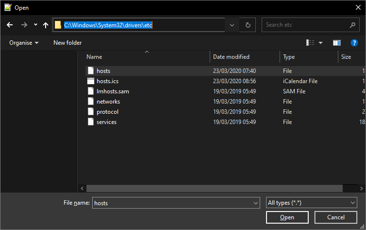
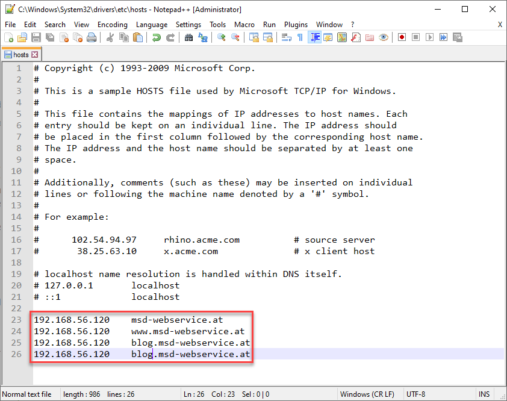
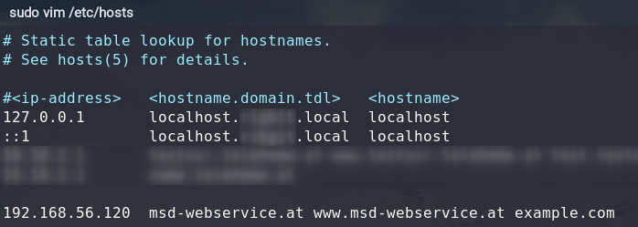

# Prerequisites

To work with different vhosts, we will need some (sub)-domains. In a real world environment, you will have registered some domain and make the necessary dns configuration on a public dns-server. this is in our restricted environment not possible, respectively would a configuration of a dns server go too far at this point. 

To be able to access our webserver with different domains, we can change the `etc/hosts` file on our local pc (_**not** in the vm!_).

## On Windows

Open the file `C:\Windows\System32\drivers\etc\hosts` with a texteditor (e.g. [Notepad++](https://notepad-plus-plus.org/)).

> Make sure you run the texteditor **as administrator**! Otherwise, you wouldn't be able to override/change the `hosts` file!



Inside the `hosts` file, add at the bottom your custom configuration. The format is `<ip-address> <hostname>`. **Make sure you choose the ip of your vm!**



> You can add any ip/domain combination. With the `etc/hosts` you're also able to simple *block* some public sites, e.g. facebook etc.

## On macOS/Linux

Open the file `/etc/hosts/` with a texteditor (e.g. `vim` from the command line).

> As well as on windows, make sure you are admin/root. otherwise you're not able to save your changes!



As you can see on the image above, you are also able to set multiple domains for one ip in one line, simple separated by blanks.

## Test set hosts

To test if the name resolutions works as expected, you can simple `ping` the domain.

```console
$ ping msd-webservice.at
Pinging msd-webservice.at [192.186.56.120] with 32 bytes of data:
Reply from 192.186.56.120: bytes=32 time=36ms TTL=52
Reply from 192.186.56.120: bytes=32 time=36ms TTL=52

$
```

When you already started [apache](./01_apache.md) or [nginx](./01_nginx.md) webserver, you can also test it by calling the URL in your local browser.


***

* [README](../README.md)
* [Apache](01_apache.md)
* [Nginx](02_nginx.md)
* [HTTP Proxy](03_proxy.md)
