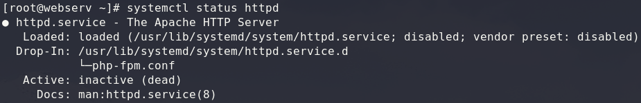
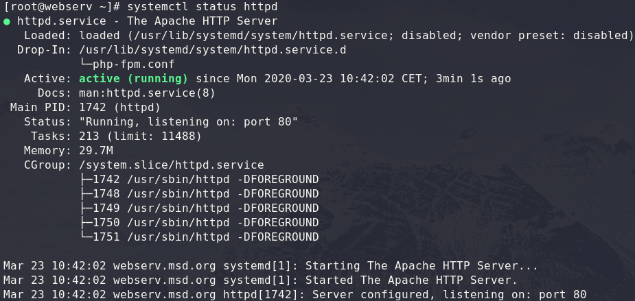
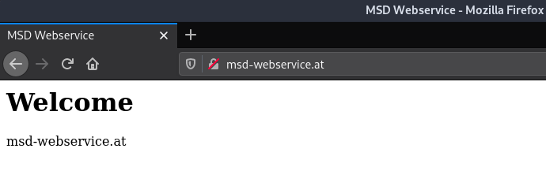
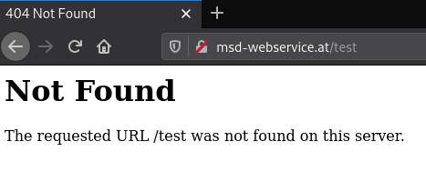

# Apache configuration

As first exercise, we will configure an [apache webserver](https://httpd.apache.org/docs/2.4/). After you started the vm the first time, apache, as well as nginx should be disabled. Before you start, check that neither apache, nor nginx are running.  

> All commands and configurations in this exercise are to do as `root`!

```bash
systemctl status httpd
systemctl status nginx
```

For this exercise, start just apache.

```bash
systemctl start httpd
```

> note that after a restart of your vm apache is stopped again!

## Useful commands

**Start Apache Webserver**
```bash
systemctl start httpd
```

**Stop Apache Webserver**
```bash
systemctl stop httpd
```

**Check Apache Configuration**
```bash
apachectl -t
# or
httpd -t
```

**Restart Apache Webserver**
```bash
systemctl restart httpd
# better!
httpd -t && systemctl restart httpd
```

**Reload Apache Webserver**
```bash
systemctl reload httpd
# better!
httpd -t && systemctl reload httpd
```

**Get Status of Apache Webserver**
```bash
systemctl status httpd
```
***Stopped* Apache**  


***Started* Apache**


***

## Prerequisites

Before you start, take a look into the **[Prerequisites](./00_prerequisites.md)**, so that you can call the pages by there set up domain names!

***

## VHost 
At first, we will configure some vhosts. You can choose any domain that you want, I will use `msd-webservice.at`.

### Add custom configuration
On CentOS, you can find the central configuration file in `/etc/httpd/conf/httpd.conf`. In the end, you would be able to set all configurations inside of that file, but that wouldn't be a good practice!

Except in special situations you should create separate configuration files. 

Especially for virtual hosts it is best practice to create a separate configuration file for each domain. in CentOS the folder `/etc/httpd/conf.d/` is intended for this purpose.

Create a new configuration for your custom domain (in my case *msd-webservice.at*).

```bash
vim /etc/httpd/conf.d/msd-webservice.at.conf
```

> all your custom configuration inside `/etc/httpd/conf.d/` must end with `.conf`, otherwise apache will ignore them!

**/etc/httpd/conf.d/msd-webservice.at.conf**
```apache
<VirtualHost *:80>
  ServerName  msd-webservice.at
  ServerAlias www.msd-webservice.at

  DocumentRoot /var/www/msd-webservice.at/html

  ErrorLog  /var/www/msd-webservice.at/logs/error.log
  CustomLog /var/www/msd-webservice.at/logs/access.log combined
</VirtualHost>
```

> **What is the meaning of the rows?**
> 
> ```apache
> <VirtualHost *:80>
> </VirtualHost>
> ```
> Declares a `VirtualHost` directive, which will listen on all available ip-addresses (`*`) on port 80 (`:80`). This means, that this directive will handle all requests on port 80 (*HTTP*), that will be send on this server.
> 
> ```apache
> ServerName  msd-webservice.at
> ServerAlias www.msd-webservice.at
> ```
> 
> To handle just request for the domain `msd-webservice.at`, we use the `ServerName` directive inside of the `<VirtualHost></VirtualHost>` block.
> 
> The `ServerAlias` directive allows, to define alternative (sub)-domains that should be handelt by this VirtualHost.
> 
> ```apache
> DocumentRoot /var/www/msd-webservice.at/html
> ```
> 
> The `DocumentRoot` directive sets the location of our provided files. The root-folder of our VirtualHost.
> 
> ```apache
> ErrorLog  /var/www/msd-webservice.at/logs/error.log
> CustomLog /var/www/msd-webservice.at/logs/access.log combined
> ```
>  
> With `ErrorLog` the location for error-log output will be set. `CustomLog ... combined` will be the location for access logging.

> **Additional Information**
> * [`VirtualHost`](https://httpd.apache.org/docs/2.4/en/vhosts/name-based.html)
> * [`ServerName`](https://httpd.apache.org/docs/2.4/de/mod/core.html#servername)
> * [`ServerAlias`](https://httpd.apache.org/docs/2.4/de/mod/core.html#serveralias)
> * [`DocumentRoot`](https://httpd.apache.org/docs/2.4/en/mod/core.html#documentroot)
> * [`ErrorLog`](https://httpd.apache.org/docs/2.4/en/mod/core.html#errorlog)
> * [`CustomLog`](https://httpd.apache.org/docs/2.4/logs.html#accesslog)

Next, we need to create the expected folder-structure for our new virtual host. We need the `DocumentRoot`, as well as the folder for our log files.

```bash
mkdir -p /var/www/msd-webservice.at/html
mkdir -p /var/www/msd-webservice.at/logs
```

To ensure that a request without a specific file will returned, we need a `index.html` in our `DirectoryRoot`. 

**Create a `index.html` with a custom content inside your set `DirectoryRoot`.**

```tree
/var/www/msd-webservice.at/
├── html
│   └── index.html
└── logs
```

> The log files `error.log` and `access.log` do not have to be created manually. They will be created automatically by apache!

When everything is correctly set up, we need to reload the apache service once, so that it will re-read the configuration files and applies the changes.

```bash
httpd -t && systemctl reload httpd
```

> When there is an error (e.g. typo) in your configuration, apache may will stop. In that case, you need to fix the error and start the service again, because it will stop on error!  
> But apache will not stop on every error. When `systemctl reload httpd` takes several seconds and does not return an error message, this could also be a sign that something probably did not work. Check the **status** and look for *Warning* or *Error*.  
> Therefore, always test (`httpd -t`) the configuration before `reload`/`restart`!

When you get no error, you should be able to open your created website from your local computer. For example with Firefox.


***

#### Create a second VirtualHost

After you created your first **VirtualHost**, create a second one with another (sub)-domain. Don't forget to adapt your local `etc/hosts`!

***

### Custom ErrorDocument

Apache has its own default error responses, for example when you try to get a resource that is not available.


You can set your own error responses inside your **VirtualHost** configuration (as well inside a [`.htaccess`](#htaccess) file, which we will cover a little later).

Extend your config...

```apache
<VirtualHost *:80>
  # ...
  
  ErrorDocument 403 /error/403.html
  ErrorDocument 404 /error/404.html
  ErrorDocument 500 "Something went wrong, sorry :("
  
  # ...
</VirtualHost>
```

> **What is the meaning of the rows?**
> 
> ```apache
> ErrorDocument 404 /error/404.html
> ```
> With the `ErrorDocument` directive, you can customize every HTTP error (4xx or 5xx) status output. In the example above, on **404** you will return the 404.html inside the `/error/` sub-folder of your `DocumentRoot`! (*ErrorDocument redirects to a local URL, if it starts with a **/**!*)  
> Alternatively, you can also return text directly, as shown in the example above for error 500.

> **Additional Information**
> * [`ErrorDocument`](https://httpd.apache.org/docs/2.4/custom-error.html)

Do make the additional configuration work, create the directory `error` inside your DocumentRoot and add the html-files for 404 and 403 (and don't forget to `reload` the httpd-service!).

```tree
/var/www/msd-webservice.at/
├── html
│   ├── error
│   │   ├── 403.html
│   │   └── 404.html
│   └── index.html
└── logs
```

You can 404 easily test by trying to call up a path that does not exist. (e.g. *msd-webservice.at/not-exist*).

To test 403, simple try to call *msd-webservice.at/error*. Because there is no index.html inside, you will return the 403 error page.

5xx errors to test is a bit more difficult.

### mod_rewrite

With the module mod_rewrite we are able to manage incoming requests based on self defined regular expressions.

For example, redirect paths that are no longer available, or change the request for further CGI processing.

As a first example we want to respond to a specific path with the HTTP error 500, so that we can test our custom error text from the previous example.

For that, extend the config file for your **VirtualHost**

```apache
<VirtualHost *:80>
  # ...
  
  <Directory "/var/www/msd-webservice.at/html">
    RewriteEngine On
    RewriteCond %{REQUEST_FILENAME} !-f
    RewriteRule "^test.*$" - [R=500]
  </Directory>

  # ...
</VirtualHost>
```

> **What is the meaning of the rows?**
> 
> ```apache
> <Directory "/var/www/msd-webservice.at/html">
> </Directory>
> ```
> To specify where the should apply, we need a `Directory` directive. This block will enclose a group of directives that will apply only to the named directory and sub-directories, as well as the files inside of them.  
> Because the destination of the request will be the `DocumentRoot` of our `VirtualHost`, we need to set up that path here.
> ```apache
> RewriteEngine On
> ```
> With that directive, we activate the ability to set `RewriteRule`s for the `Directory`.
> ```apache
> RewriteCond %{REQUEST_FILENAME} !-f
> RewriteRule "^test.*$" - [R=500]
> ```
> `RewriteCond` defines a rule condition. One or more Conds can precede a `RewriteRule`, which will only used if both, the current state of the URI and if the condition(s) are met.   
> The above `RewriteCond` checks, if the requested file is no regular file (or the file does not exists).  
> The `RewriteRule` is a regular expression and checks if the request path starts with *test*. if that is the case, we will perform a **R**edirect with the specific HTTP status code 500.  


> **Additional Information**
> * [`Directory`](https://httpd.apache.org/docs/2.4/mod/core.html#directory)
> * [`RewriteCond`](https://httpd.apache.org/docs/2.4/mod/mod_rewrite.html#rewritecond)
> * [`RewriteRule`](https://httpd.apache.org/docs/2.4/mod/mod_rewrite.html#rewriterule)
>   * [Flags](https://httpd.apache.org/docs/2.4/mod/mod_rewrite.html#rewriteflags)

***

#### Rewrite

When enough time is left, try with the help of the links above to create some more rewrites. If you find some nice working redirects, [share](https://elearning.fh-joanneum.at/mod/forum/view.php?id=26168) it with your colleges.

***

### htaccess

Up to this point, we have just set up the configuration on server-level. In a typical webhosting, you usually only get more or less one folder (`DocumentRoot`) for your files (html, maybe php) and no - or only a limited - possibility to configure apache yourself.

If the provider allows you to use a **.htaccess** file, you can use it to set up some settings yourself, such as `RewriteRules`.

> With .htaccess only configurations/rules on `Directory` level can be done. The additional installation/activation of extra modules, or configurations such as a `VirtualHost` are not possible!

To allow the usage of **.htaccess**, you have first to change your `VirtualHost` configuration.

```apache
<VirtualHost *:80>
  # ...

  <Directory "/var/www/msd-webservice.at/html"> 
    AllowOverride All
    # ...
  </Directory

  # ...
</VirtualHost>
```

> **What is the meaning of the rows?**
> 
> ```apache
> AllowOverride All
> ```
> The `AllowOverride` directive enables the usage of a .htaccess file inside the given `Directory`. Per default, `AllowOverride` is set to `None`. With `All`, all possible directives can be overwritten.  
> You can set `AllowOverride` per (sub)-directory, as well as you can add a separate .htaccess to all subdirectories!

> **Additional Information**
> * [`AllowOverride`](https://httpd.apache.org/docs/2.4/en/mod/core.html#allowoverride)
> * [.htaccess](https://httpd.apache.org/docs/2.4/howto/htaccess.html)

After you restarted apache, change into your `DocumentRoot` and add a **.htaccess** on top level.

Inside this file, we will redirect non-www to www domain.

```apache
RewriteEngine On
RewriteBase /
RewriteCond %{HTTP_HOST} !^www. [NC]
RewriteRule ^(.*)$ http://www.%{HTTP_HOST}/$1 [R=301,L]
```

> **Additional Information**
> * [`RewriteBase`](https://httpd.apache.org/docs/2.4/mod/mod_rewrite.html#rewritebase)

> When you make changes inside a .htaccess file, you **don't** need to restart the apache webserver!

Another possibilities are to activate directory indexing, or deny the access to a specific (sub)directory or for specific ip-addresses.

> **Additional Information**
> * [`Options`](https://httpd.apache.org/docs/2.4/en/mod/core.html#options)
> * [`Allow`](https://httpd.apache.org/docs/2.4/en/mod/mod_access_compat.html#allow) and [`Deny`](https://httpd.apache.org/docs/2.4/en/mod/mod_access_compat.html#deny)
> * [Basic Authentication](https://httpd.apache.org/docs/2.4/howto/auth.html)

***

When enough time is left, try with the help of the links above to experiment with additional configurations inside of the **.htaccess**. Try also different **.htaccess** files inside of subdirectories!

***


***

* [README](../README.md)
* [Prerequisites](00_prerequisites.md)
* [Nginx](02_nginx.md)
* [HTTP Proxy](03_proxy.md)
